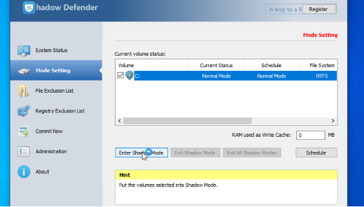

Seguridad y Alta Disponibilidad

Volodimir Yarmash Yarmash

Índice

[**Objetivos:	3**](#_tyvytlmdjdx3)**

[**Teoría Congeladores	3**](#_7ccgtzy7tlx9)

[**Qué hay que hacer:	3**](#_s4qfeav51az6)

[**1. Funciones del programa (¿para qué sirve?).	3**](#_8mxvt6k2bqsr)

[**2. Instalación paso a paso del programa (incluir capturas)	4**](#_ylr7sda3k00k)

[**3. Configuración.	6**](#_itj74s638t6e)

[**4. Ejemplo de uso paso a paso (incluir capturas). En este apartado hay que comprobar que, efectivamente, después de reiniciar el sistema ha borrado toda la información y está como al principio	6**](#_k90imfjvegkn)

[**5. Explica cómo podrías evitar que al reiniciar se perdieran las actualizaciones del antivirus. Instálate antes uno.	8**](#_btp5innukrts)

# Objetivos:
• Conocer la técnica de congelación del sistema operativo junto con sus diferentes

funcionalidades y sus posibilidades de uso.

• Instalar, configurar y usar programas para la congelación del sistema.

# Teoría Congeladores
Los programas llamados congeladores del sistema instalados en un sistema operativo

permiten que los usuarios realicen cambios en la configuración, instalen software,

recuerden el historial de navegación, las cookies o contraseñas, ... pero al reiniciar el

equipo todos estos cambios desaparecen y el sistema vuelve al punto original

configurado. Evidentemente, los cambios que los usuarios tienen permitidos realizar se

controlan con directivas de grupos, listas de control de acceso y permisos.

Este tipo de software se instala en ordenadores que son usados por muchas personas,

que utilizan dispositivos extraíbles, descargan software de dudosas fuentes, ... como las

aulas de los centros educativos, cibercafés, bibliotecas públicas, ...

Pero ¿qué pasa con las actualizaciones del sistema o del antivirus? Ésas no interesan

perderlas una vez instaladas. ¿Y si deseamos instalar software y que no se borre al

reiniciar el equipo? Pues dependiendo del software utilizado, algunos permiten que

estos cambios sean permanentes y otros no.

Ejemplos de congeladores:

• DeepFreeze

• CleanSlate

• DriveShield

• Shadow Defender

• Custodius

• Windows Steady State

# Qué hay que hacer:
Vamos a realizar un estudio de una de las aplicaciones anteriores: ShadowDefender. Puedes

descargar una versión de prueba desde aquí:

https://www.shadowdefender.com/

Se trata de que realices un tutorial en PDF donde aparezcan los siguientes puntos:
# 1. Funciones del programa (¿para qué sirve?).
El programa sirve para eliminar la sesión del usuario actual una vez se cierre la sesión

(normalmente), aunque también puede configurarse para que los datos se borren cuando

se realice otra acción.

# 2. Instalación paso a paso del programa (incluir capturas)
Entramos en la página oficial y descargamos el software:

Introducimos nuestro nombre

Llegados hasta el final y pulsamos “install”

# 3. Configuración.
Para configurarlo, nos dirigimos al apartado “Mode Setting” y seleccionamos el volumen

que queremos configurar para que el congelador elimine los datos una vez se cierre la

sesión del usuario. También se pueden configurar exclusiones de carpetas, ficheros,

registros o programas.

# 4. Ejemplo de uso paso a paso (incluir capturas). En este apartado hay que comprobar que, efectivamente, después de reiniciar el sistema ha borrado toda la información y está como al principio
Entramos al modo Shadow y creamos una carpeta con contenido.

Hacemos restart:

Al reiniciarse el equipo, se ha borrado el contenido que habíamos creado.

# 5. Explica cómo podrías evitar que al reiniciar se perdieran las actualizaciones del antivirus. Instálate antes uno.
Para que al reiniciar no se pierdan, vamos al apartado de Registry Exclusion List y le

damos a añadir y seleccionamos el antivirus.

Y con esto estaría listo.

