![ref1]

Servicio de Red e Internet

Volodimir Yarmash Yarmash

Índice

[**Lee los siguientes artículos	3**](#_b9hn2cw6aavl)**

[**Ejecuta la imagen "hello-world"	3**](#_2znu2rbiammz)

[**Muestra las imágenes Docker instaladas	4**](#_j108mzprpnqx)

[**Muestra los contenedores Docker	5**](#_t26ozvbb8zlp)

[**Edita el fichero Dockerfile	5**](#_7tcqxeldky5z)

[**Construye el contenedor	6**](#_d2mfpyupn198)

[**Ejecútalo	6**](#_exixaaamyzgf)

[**Create una cuenta en hub.docker.com	7**](#_1tcnnk2sh174)

[**Publícalo	8**](#_d6ohpoewxusl)

# Lee los siguientes artículos
<https://docs.docker.com/get-started/>

<https://docs.docker.com/get-started/part2/>

# Ejecuta la imagen "hello-world"
Vamos a arrancar la imagen de hello-world para finalmente comprobar si todo está en orden.

`sudo docker run hello-world`

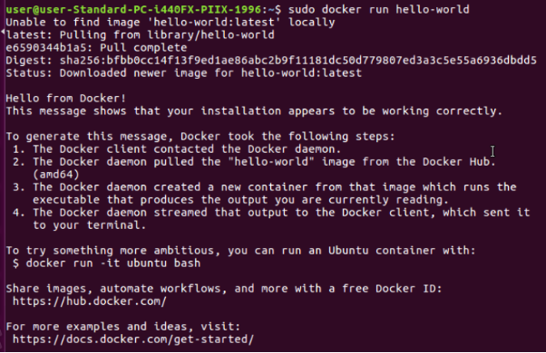

Comandos importantes:

docker - Te muestra una lista de todos los comandos disponibles.

sudo docker version - te muestra la versión instalada de Docker

sudo docker info - te muestra la información de docker, como sus rutas y configuración.

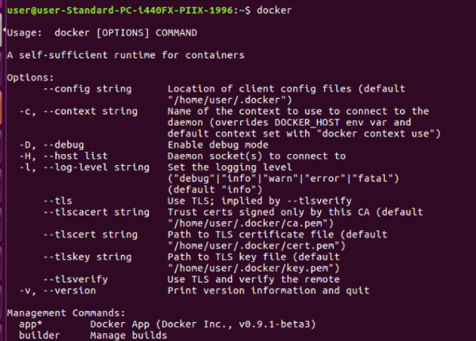

Por ejemplo, vamos a instalar una imagen de Docker llamada CentOS 7. Con este comando:

sudo docker search centos

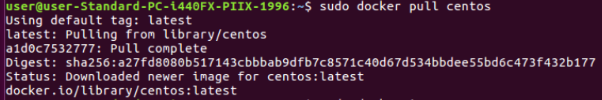

# Muestra las imágenes Docker instaladas
Podemos listar todas nuestras imágenes con:

sudo docker images

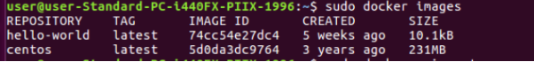

Y finalmente borrar imagen con el comando:

sudo docker rmi centos

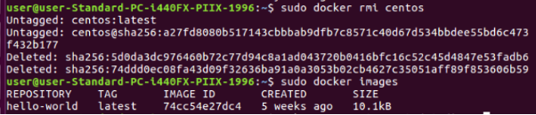

# Muestra los contenedores Docker
En caso de que queramos ver todos los contenedores que se han ejecutado en nuestro sistema, podemos utilizar la siguiente orden:

sudo docker ps -a

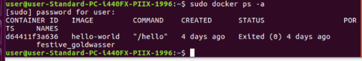
# Edita el fichero Dockerfile
Para editar el archivo Dockerfile, podemos utilizar cualquier editor de texto, aqui emplearemos nano con el siguiente comando:

sudo nano (ruta)/Dockerfile

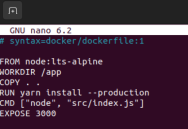
# Construye el contenedor
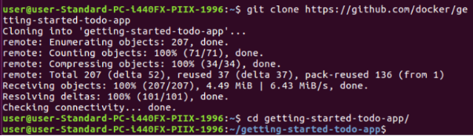

Entramos a la carpeta e introducimos este comando:

sudo docker build -t (nombre de imagen) .

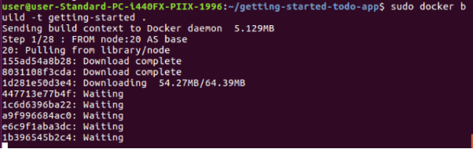

# Ejecútalo
Vamos a ejecutar la imagen hello world con este comando:

sudo docker run -d -p 127.0.0.1:3000:3000 getting-started

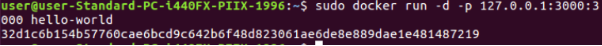

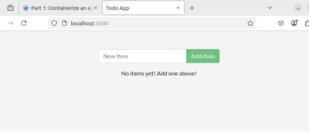
# Create una cuenta en hub.docker.com
Entramos en la pagina oficial de DOCKER HUB

Y nos registramos

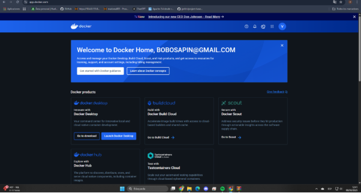

Para entrar a docker introducimos el siguiente comando:

sudo docker login -u (usuario)

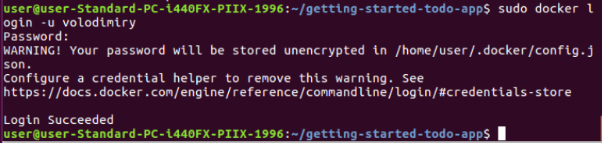
# Publícalo
Con todo ello , ya podemos publicar nuestra imagen en Dockerhub con el siguiente comando

sudo sudo docker push volodimiry/getting-started

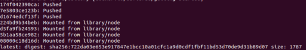

[ref1]: Aspose.Words.4fe7be42-cd15-4354-84d9-a9af89f3e981.001.png
