![ref1]

Servicio de Red e Internet

Volodimir Yarmash Yarmash

Índice

[**Descarga la imagen de ubuntu, imagen de hello-world y nginx	3**](#_5ulsi0xu6vdv)**

[**Muestra un listado de todas la imágenes	3**](#_wt1k8rn00dw9)

[**Ejecuta un contenedor hello-world y dale nombre “myhello1”	4**](#_x8fr65fnvov6)

[**Ejecuta un contenedor hello-world y dale nombre “myhello2”	5**](#_jqvri2apjwh7)

[**Ejecuta un contenedor hello-world y dale nombre “myhello3”	5**](#_erkaiqxvhzyj)

[**Muestra los contenedores que se están ejecutando	6**](#_hemnm0qk63se)

[**Para el contenedor "myhello1”	6**](#_5gylkjsmyso)

[**Para el contenedor "myhello2”	6**](#_qservpoyr5np)

[**Borra el contenedor “myhello1”	6**](#_vqky9pxz0htm)

[**Muestra los contenedores que se están ejecutando.	7**](#_irzat8hc0rdi)

[**Borra todos los contenedores	7**](#_f564599n8gr1)

# Descarga la imagen de ubuntu, imagen de hello-world y nginx
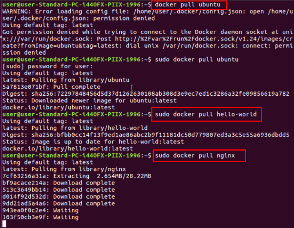
# Muestra un listado de todas la imágenes
Lo podemos listar con el comando:

`sudo docker images-a`

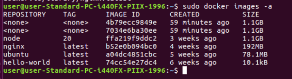

# Ejecuta un contenedor hello-world y dale nombre “myhello1”
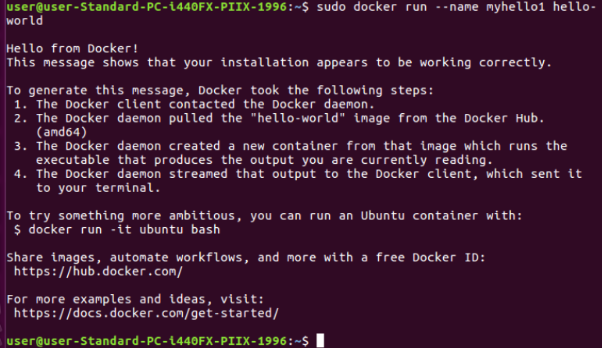
# Ejecuta un contenedor hello-world y dale nombre “myhello2”
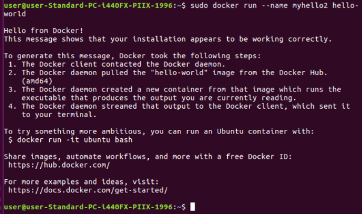
# Ejecuta un contenedor hello-world y dale nombre “myhello3”
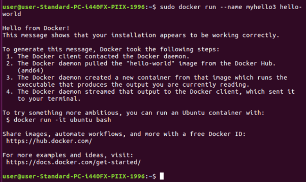
# Muestra los contenedores que se están ejecutando
Vamos a ver la  lista de contenedores creados ejecutados:

`docker ps -a`

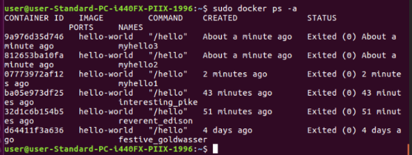

Y para ver los ejecutados:

`sudo docker ps `

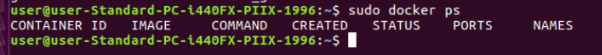
# Para el contenedor "myhello1”
Para detener un contenedor usamos el comando:

`sudo docker stop (contenedor)`

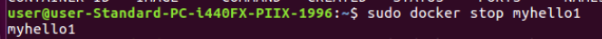
# Para el contenedor "myhello2”
Repetimos el comando:

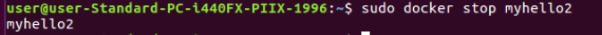
# Borra el contenedor “myhello1”
Pra borrar un contenedor tenemos que usar este comando:

`sudo docker rm (nombre)`

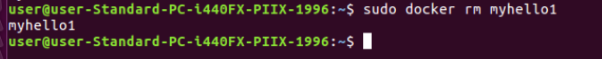
# Muestra los contenedores que se están ejecutando.
Usamos el comando de nuevo

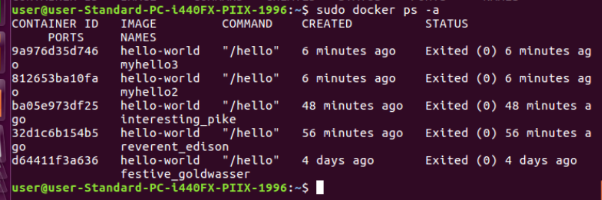
# Borra todos los contenedores
Para borrar TODOS los contenedores usamos: 

`docker ps -aq | xargs docker rm`

[ref1]: Aspose.Words.6b3984bc-b2d1-4d7a-8cd3-7865a106fb97.001.png
