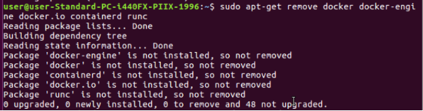
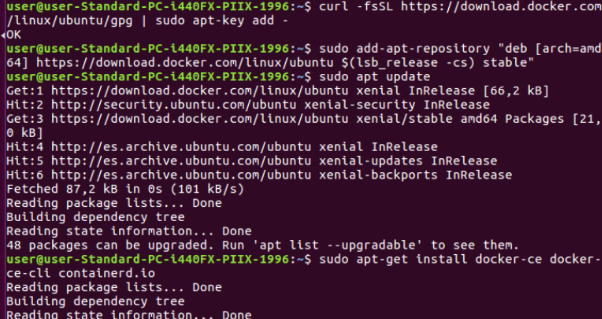
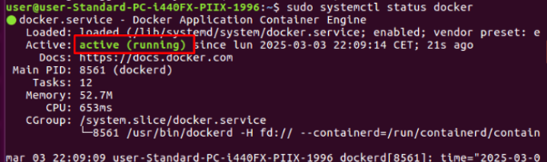
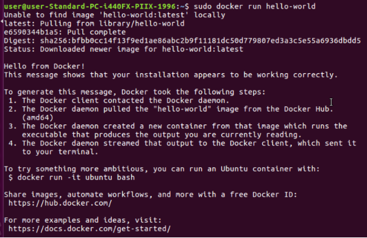
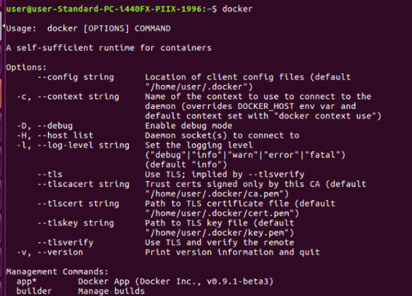
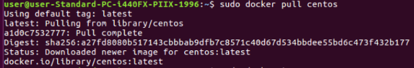
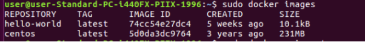
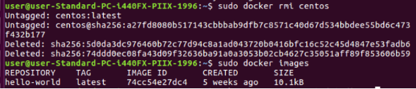

![ref1]

Servicio de Red e Internet

Volodimir Yarmash Yarmash

![ref1]

Índice

[**1. Instalación Docker	3**](#_811s03xg1t3a)**

![ref1]

1. # Instalación Docker
Para instalar docker, vamos a asegurar que no tenemos ninguna versión previa, para que no nos generen errores.

sudo apt-get remove docker docker-engine docker.io containerd runc

Vamos a instalar el Repositorio de Docker para dentro instalar docker.

$ sudo apt-get update

$ curl -fsSL https://download.docker.com/linux/ubuntu/gpg | sudo apt-key add -

$ sudo add-apt-repository "deb [arch=amd64] https://download.docker.com/linux/ubuntu $(lsb\_release -cs) stable"

E instalamos docker:

$ sudo apt-get install docker-ce docker-ce-cli containerd.io

Comprobamos con el comando 

sudo systemctl status  docker

Vamos a arrancar la imagen de hello-world para finalmente comprobar si todo está en orden.

sudo docker run hello-world

Comandos importantes:

docker - Te muestra una lista de todos los comandos disponibles.

sudo docker version - te muestra la versión instalada de Docker

sudo docker info - te muestra la información de docker, como sus rutas y configuración.

Por ejemplo, vamos a instalar una imagen de Docker llamada CentOS 7. Con este comando:

sudo docker search centos

Podemos listar todas nuestras imágenes con:

sudo docker images

Y finalmente borrar imagen con el comando:

sudo docker rmi centos

[ref1]: Aspose.Words.f4738e76-39f6-4b2c-92db-7902e82250df.001.png
