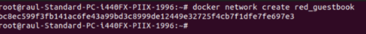
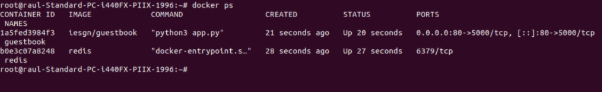
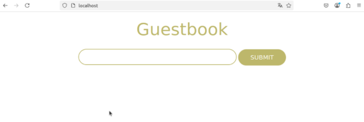

![ref1]

Servicio de Red e Internet

Volodimir Yarmash Yarmash

![ref1]

Índice

[**Redes	3**](#_5w3apdiw2km2)**

[**Despliegue de los contenedores	4**](#_dzasw7k6wpcb)

[**Configuración de la aplicación Guestbook	4**](#_nn863rszhqf0)

![ref1]

Realizar GuestBook - Ejemplo 1 

<https://github.com/josedom24/curso_docker_ies/blob/main/modulo3/guestbook.md>

En este ejemplo vamos a desplegar una aplicación web que requiere de dos servicios (servicio web y servicio de base de datos) para su ejecución. La aplicación se llama GuestBook y necesita los dos siguientes servicios:

La aplicación guestbook es una aplicación web desarrollada en python que es servida por el puerto 5000/tcp. Utilizaremos la imagen iesgn/guestbook.

Esta aplicación guarda la información en una base de datos no relacional redis, que utiliza el puerto 6379/tcp para conectarnos. Usaremos la imagen redis.

Volúmenes

Si estudiamos la documentación de la imagen redis en Docker Hub, para que la información de la base de datos se guarde en un directorio /data del contenedor hay que ejecutar el proceso redis-server con los argumentos --appendonly yes.

# Redes

La aplicación guestbook por defecto utiliza el nombre redis para conectarse a la base de datos, por lo tanto debemos nombrar al contenedor redis con ese nombre para que tengamos una resolución de nombres adecuada.

Los dos contenedores tienen que estar en la misma red y deben tener acceso por nombres (resolución DNS) ya que de principio no sabemos que ip va a coger cada contenedor. Por lo tanto vamos a crear los contenedores en la misma red:

$ docker network create red\_guestbook

# Despliegue de los contenedores
Ejecutamos los contenedores de Redis y Guestbook en la misma red:

docker run -d --name redis --network red\_guestbook -v /opt/redis:/data redis redis-server --appendonly yes

docker run -d -p 80:5000 --name guestbook --network red\_guestbook iesgn/guestbook

# Configuración de la aplicación Guestbook
En la imagen iesgn/guestbook, se ha definido una variable de entorno llamada REDIS\_SERVER, que indica el nombre del servidor de base de datos Redis al que se conectará la aplicación. Su valor por defecto es redis.

Si creamos un contenedor Redis con otro nombre, por ejemplo:

docker run -d --name contenedor\_redis --network red\_guestbook -v /opt/redis:/data redis redis-server --appendonly yes

Entonces, debemos configurar la aplicación guestbook para que use ese nuevo nombre. Para ello, pasamos la variable de entorno REDIS\_SERVER al crear el contenedor:

docker run -d -p 80:5000 --name guestbook -e REDIS\_SERVER=contenedor\_redis --network red\_guestbook iesgn/guestbook

[ref1]: Aspose.Words.822d4e8b-b844-43fc-8dc6-61e6be598d82.001.png
