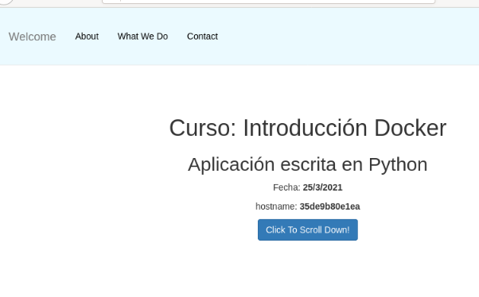

![ref1]

Servicio de Red e Internet

Volodimir Yarmash Yarmash

![ref1]

Índice

[**Ejemplo 3: Construcción de imágenes con una una aplicación Python	3**](#_3kynt3e3b421)**

[**Algunas consideraciones:	3**](#_dbi3ms4fr5os)

[**Para crear la imagen ejecutamos:	3**](#_tadrtmuwg6id)

[**Comprobamos que la imagen se ha creado:	4**](#_pefjj1na7vgv)

[**Y podemos crear un contenedor:	4**](#_vfpz6fl2iwmb)

[**Versión 2: Desde una imagen con python instalado	4**](#_uop2vy9mqf55)

![ref1]
# Ejemplo 3: Construcción de imágenes con una una aplicación Python
En este ejemplo vamos a construir una imagen para servir una aplicación escrita en Python utilizando el framework flask. La aplicación será servida en el puerto 3000/tcp. Puedes encontrar los ficheros en este directorio del repositorio.

En el contexto vamos a tener el fichero Dockerfile y un directorio, llamado app con nuestra aplicación.

En este caso vamos a usar una imagen base de un sistema operativo sin ningún servicio. El fichero Dockerfile será el siguiente:

`FROM debian:12`

`RUN apt-get update && apt-get install -y python3-pip  && apt-get clean && rm -rf /var/lib/apt/lists/\*`

`WORKDIR /usr/share/app`

`COPY app .`

`RUN pip3 install --no-cache-dir --break-system-packages -r requirements.txt`

`EXPOSE 3000`

`CMD python3 app.py`
# Algunas consideraciones:

Sólo tenemos que instalar pip, que utilizaremos posteriormente para instalar los paquetes Python.

Copiamos nuestra aplicación en cualquier directorio.

Con WORKDIR nos posicionamos en el directorio indicado. Todas las instrucciones posteriores se realizarán sobre ese directorio.

Instalamos los paquetes python con pip, que están listados en el fichero requirements.txt.

El proceso que se va a ejecutar por defecto al iniciar el contenedor será python3 app.py que arranca un servidor web en el puerto 3000/tcp ofreciendo la aplicación.
# Para crear la imagen ejecutamos:

`$ docker build -t volodimiry/ejemplo3:v1 .`
# Comprobamos que la imagen se ha creado:

`$ docker images`

# Y podemos crear un contenedor:

`$ docker run -d -p 80:3000 --name ejemplo2 volodimiry/ejemplo3:v1`

Y acceder con el navegador a nuestra página con LOCALHOST:

# Versión 2: Desde una imagen con python instalado
En este caso el dichero Dockerfile podría ser de esta manera:

`FROM python:3.12.1-bookworm`

`WORKDIR /usr/share/app`

`COPY app .`

`RUN pip install --no-cache-dir -r requirements.txt`

`EXPOSE 3000`

`CMD python app.py`

[ref1]: Aspose.Words.a94d6e90-2d1d-49be-831c-66a08f5af880.001.png
