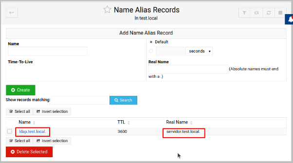
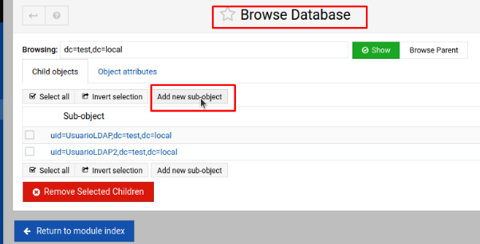

![ref1]

Administración de Sistemas Operativos

Volodimir Yarmash Yarmash

![ref1]

Índice

[**1. Instala Ldap con Webmin en un servidor Linux. Comprueba la correcta instalación de Ldap.	3**](#_lb5fdt28l8bs)**

[**2. Configura Ldap para crear un dominio utilizando Webmin.	4**](#_zd7src33f25)

[**3. Con Webmin, crea 2 usuarios y 2 unidades organizativas en el dominio y  verifica que han sido creado correctamente.	6**](#_kvqx9vl87t2d)

[**4. crea un grupo y añade los usuarios creados anteriormente a este grupo. Crea un nuevo grupo y añade uno de los usuarios a este grupo.	10**](#_nnzk40v0ms0i)

[**5. Comprueba desde la consola los cambios que se han hecho en los ejercicios anteriores.	11**](#_sxlimo6916zg)

![ref1]

# 1. Instala Ldap con Webmin en un servidor Linux. Comprueba la correcta instalación de Ldap.
Para empezar, tenemos que crear un Alias en el dns.

En el listado de UNUSED MODULES, encontramos LDAP server y lo descargamos

# 2. Configura Ldap para crear un dominio utilizando Webmin.
Introducimos la configuración y aplicamos:

Vamos a instalar la base de datos, en el panel de LDAP buscamos este botón;

Entramos y descargamos el Perl module

Después de la instalación, regresamos para comprobar si todo ha ido bien. Deberia de aparecer esto

Salimos de “browse database” y entramos a “create tree”

Seleccionamos la opción de DNS y creamos

Entramos de nuevo a la base de datos y debemos de tener algo parecido:

# 3. Con Webmin, crea 2 usuarios y 2 unidades organizativas en el dominio y  verifica que han sido creado correctamente.
Para crear usuarios y demás, necesitamos acceder a “LDSP users and groups” en el apartado de módulos sin usar

Arriba a la izquierda, pulsamos el engranaje y nos pasa a este panel de configuración. Lo rellenamos igual:

Y nos aparece la opción de crear un usuario LDAP, lo pulsamos:

Lo configuramos de esta manera:

Y nos aseguramos que es miembro de user, pulsamos create

Y repetimos de nuevo para tener 2 users:

Ahora tenemos que crear la Unidades Organizativas

Para ello no tenemos un módulo aparte, está integrado en ldap server

Entramos en “Browse database” y “Add new sub-object”

Establecemos el tipo de objeto a OU(organizationalUnit) y su nombre, también tenemos

que especificar la clase del objeto. Damos click en crear.

Este es el resultado

# 4. crea un grupo y añade los usuarios creados anteriormente a este grupo. Crea un nuevo grupo y añade uno de los usuarios a este grupo.
Para crear un grupo, nos situamos en el papel de los Un-used modules y pinchamos en “Ldap users and groups”, añadimos un grupo

En la tabla de miembros escogemos al primer usuario y le creamos el grupo 1. Y despues con el segundo

Debería de quedar así

# 5. Comprueba desde la consola los cambios que se han hecho en los ejercicios anteriores.
Para mostrar todos los cambios realizados en ldap usamos el comando “sudo slapcat”, como podemos ver aparecen tanto los grupos como los usuarios y las unidades organizativas.

[ref1]: Aspose.Words.b7b32630-8c89-4a64-8943-ce3e0bbb43ec.001.png
