# 
# Instalación de Wordpress en instancia Debian(o Ubuntu) EC2 con soporte de base de datos RDS y EFS

Volodimir Yarmash Yarmash

[`	`**1**](#_30j0zll)**

[1. Introducción.	1](#_1fob9te)

[2. Creación de instancias	1](#_3znysh7)

[3. Apache y PHP	3](#_2et92p0)

[4. Creación de la base de datos.	5](#_tyjcwt)

[5. Elastic File System.	10](#_3dy6vkm)

[6. Descarga de Wordpress	12](#_4d34og8)

1. ## Introducción.
La idea de este manual es configurar un servidor web apache montado en una instancia EC2 Debian (o Ubuntu) con un sistema de almacenamiento en EFS y la base de datos que esté gestionada por RDS en una subred privada.

Para ello necesitaremos primeramente un VPC que tenga dos subredes públicas y dos privadas.

El objeto de crear dos subredes públicas es construir al final del ejercicio un balanceador de carga que permita servir contenidos en función de la carga de los servidores.

*Para crear las subredes consulta la documentación de la sesión 1 en el apartado VPC. Para mayor facilidad las vamos a crear a partir del asistente VPC y más del servicio VPC.*

1. ## Creación de instancias
Antes de nada, vamos a crear una VPC para esta práctica.

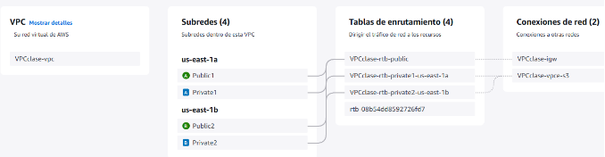

Creamos también un grupo de seguridad con estas reglas:

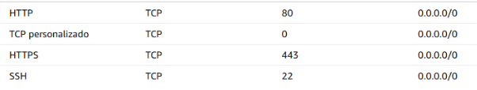

Vamos a crear una instancia usando el servicio EC2. 

Estas van a ser las características:

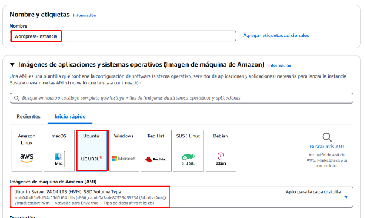

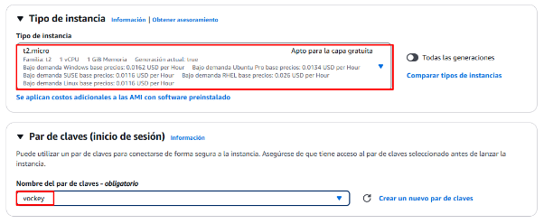

Escogemos muestra VPC, la subred publica1 y nuestro grupo de seguridad.

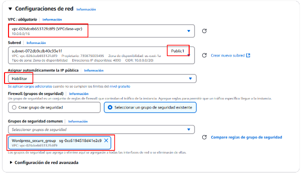

E iniciamos la instancia. Podemos conectarnos.

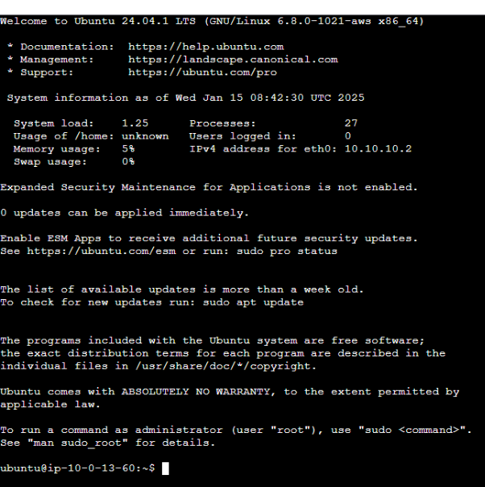
1. ## Apache y PHP

Para instalar Apache, introducimos los siguientes comandos:

`sudo apt update`

`sudo apt install apache2`

`sudo systemctl start apache2 (Para arrancar el servidor.)`

`sudo systemctl enable apache2 (para que apache inicie cada vez que arranca la instancia.)`

`sudo systemctl status apache2 (Comprobación)`

Este es el resultado:

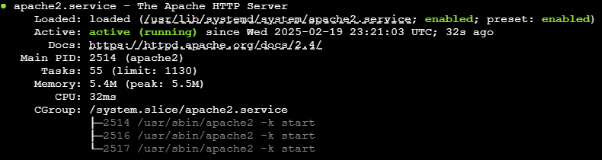

Podemos comprobarlo haciendo una petición a la ip pública de nuestra máquina con el servidor de Apache.

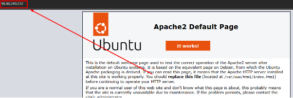

Procedemos con la instalación PHP

Instalamos php como un módulo de Apache:

`sudo apt install php libapache2-mod-php php`

También necesitamos instalar mysql como módulo de apache:

`sudo apt install php-mysql`

Y reiniciamos apache:

`sudo systemctl restart apache2`

Y comprobamos que php está finalmente instalado:

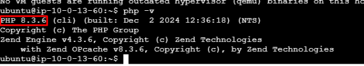

1. ## Creación de la base de datos.
RDS es un servicio de AWS que gestiona bases de datos en la nube. La base de datos puede ser gestionada desde las instancias EC2 o cualquier otro servicio de AWS que la requiera.

Vamos al servicio RDS y creamos una base de datos del tipo MySQL:

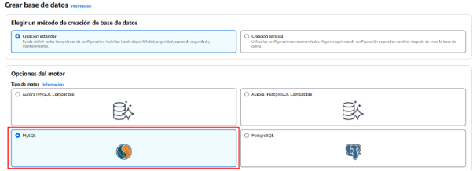

Introducimos el nombre de la base de datos, seleccionamos la opción de autoadministrado e introducimos una contraseña.

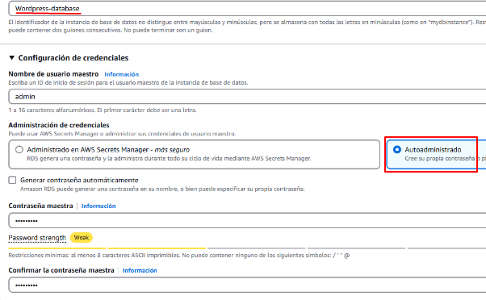

En el apartado de Conectividad, seleccionamos nuestra VPC y nuestro grupo de seguridad.

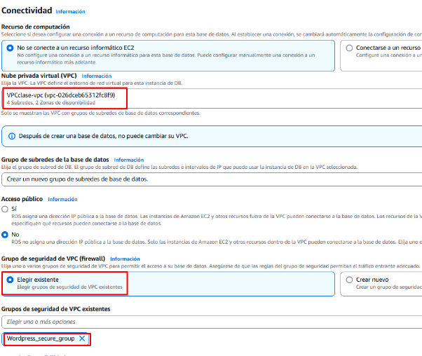

Y en configuración adicional, le asignamos un nombre a la base de datos inicial.

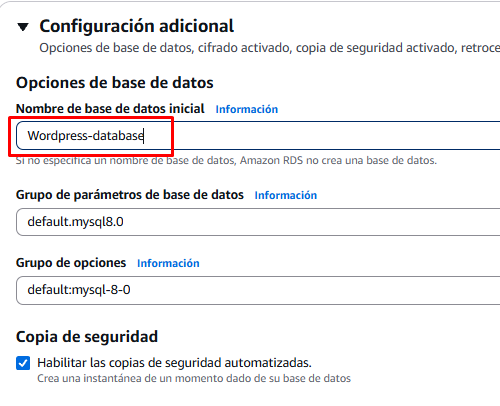

La tenemos creada, ahora tenemos que conectarla a la instancia EC2. Pulsamos en la base de datos recién creada.

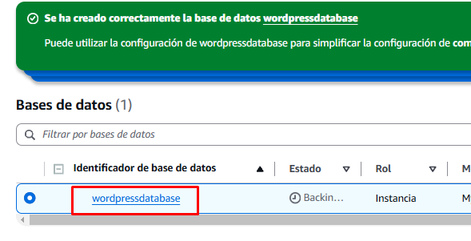

En el apartado de “Recursos de computación conectados”, nos encontramos con el botón de configuración de conexión de EC2

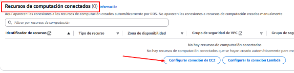

Añadimos nuestra instancia con Wordpress.

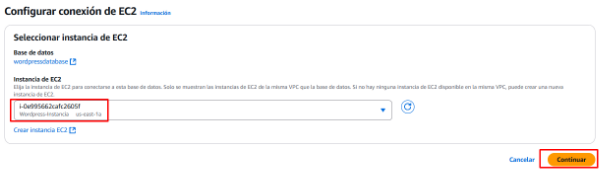

Es muy importante comprobar si el grupo de seguridad se ha actualizado. Debe aparecer un nuevo puerto en el grupo de salida.

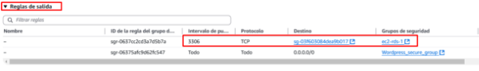

En la instancia procedemos a instalar “mariadb-server”. Introducimos todos estos comandos:

`sudo apt install mariadb-server`  /  `default-mysql-client`

`sudo systemctl enable mariadb`

`sudo systemctl start mariadb`

`sudo systemctl status mariadb`

Este debería de ser el resultado

Nos vamos a conectar a la base de datos, para ello introducimos este comando: 

`mysql -h (puerto\_de\_enlace\_BD) -u (usuario) -p`

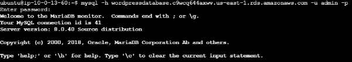

Configuración EFS

Con Amazon Elastic File System (EFS) podemos compartir un sistema de archivos entre varias instancias EC2. Para utilizarlo, se crea un sistema de archivos desde la consola de AWS y se configura su acceso para que pueda ser montado en una instancia. Esto facilita el almacenamiento y acceso a archivos desde múltiples servidores sin necesidad de configuraciones complejas.

Accedemos a la pestaña de EFS en AWS y seleccionamos Crear sistema de archivos. Ponemos un nombre y asociamos a nuestra VPC

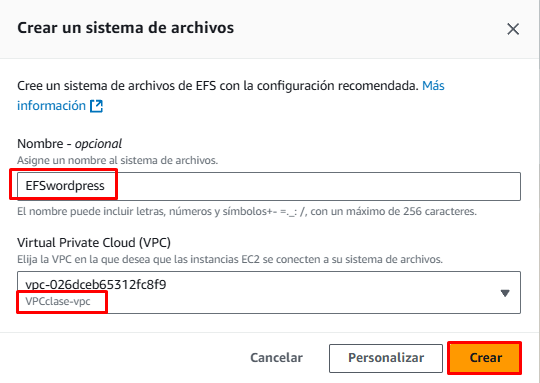

Vamos a crear un nuevo grupo de seguridad para EFS. Añadimos nfs en las reglas de entrada, de destino - el grupo de seguridad de wordpress y guardamos.

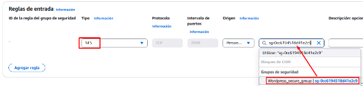

Ahora entramos en nuestra ESF y pulsamos la opción de administrar red.

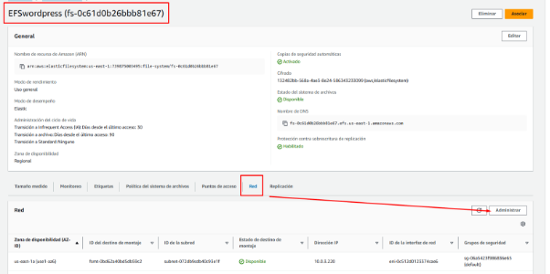

Aplicamos muestra configuración de seguridad a la red EFS

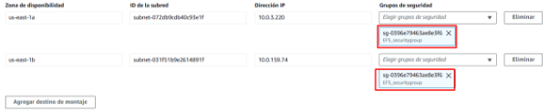

Vamos a montar nuestro EFS a nuestra instancia EC2.

Creamos la carpeta donde se va a montar el EFS: 

`mkdir efs`

Descargamos las herramientas con 

`sudo apt install amazon-efs-tools.`

En mi caso esta opción no me ha funcionado ya que no encuentra los paquetes amazon-efs-tools (posiblemente porque no estoy usando Amazon Linux, sino Ubuntu)

He investigado por mi cuenta y he encontrado una solución.

`sudo apt install nfs-common`

Después de la instalación de las herramientas en teoría debemos seguir estos pasos:

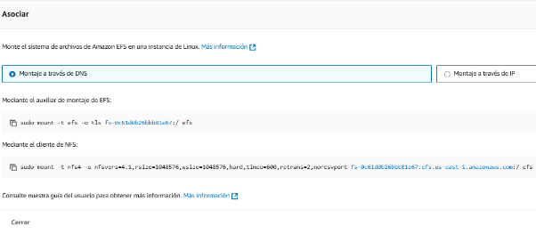

Yo he escogido usar este comando:

`sudo mount -t nfs4 -o nfsvers=4.1 (NOMBRE DEL DNS DE NUESTRO EFS):/ efs`

Ahora para comprobar si se ha montado usamos este comando:

`df -h`

1. ## Descarga de Wordpress
Tenemos que obtener el paquete oficial de wordpress desde la web y lo descomprimimos en el directorio adecuado del servidor web. Posteriormente, se configuran los archivos necesarios para conectar WordPress con la base de datos y completar la instalación a través del navegador. Esto permite desplegar un sitio web funcional en AWS con facilidad.

Descargamos la última versión de wordpress dentro de nuestro directorio de apache "/var/www/html" con el comando:

`sudo wget http://wordpress.org/latest.tar.gz`

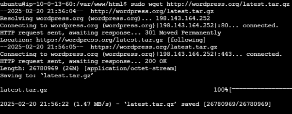

descomprimimos el fichero que hemos descargado

`sudo tar -xf latest.tar.gz`

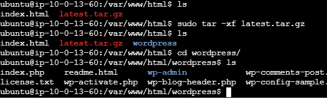

Ahora nos conectamos a nuestra base de datos con el comando:

`mysql -h (puerto\_de\_enlace\_BD) -u (usuario) -p`

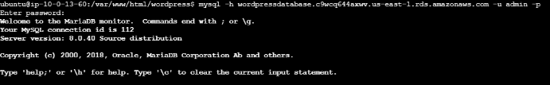

Ahora crearemos una base de datos con los comandos:

`CREATE DATABASE wordpress; `

`CREATE USER 'wordpress\_user'@'%' IDENTIFIED BY 'password123'; `

`GRANT ALL PRIVILEGES ON wordpress.\* TO 'wordpress\_user'@'%'; `

`FLUSH PRIVILEGES;`

Comprobamos si tenemos wordpress instalado, usando la ip pública de la instancia:

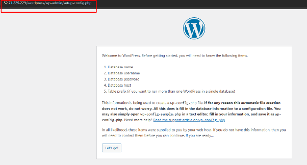

Antes de iniciar sesión en wordpress vamos a darle los permisos a estas carpetas:

`sudo chown -R www-data:www-data /var/www/html/wordpress/`

`sudo chmod -R 777 /var/www/html/wordpress/`

Nos conectamos con la información de nuestra base de datos RDS

Copiamos el punto de enlace

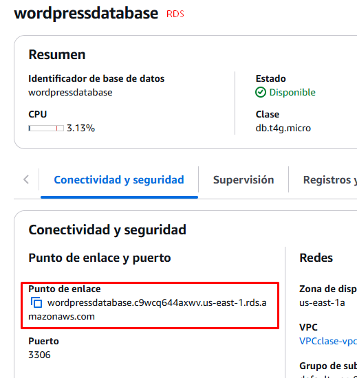 

Lo insertamos en el apartado de host y el usuario y contraseña ha de ser la de nuestra base se datos de amazon.

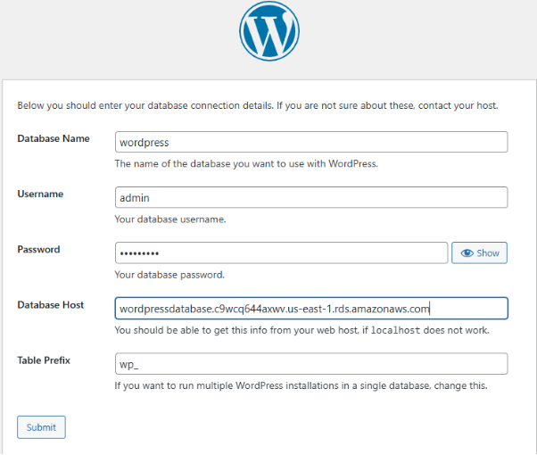

Creamos la página

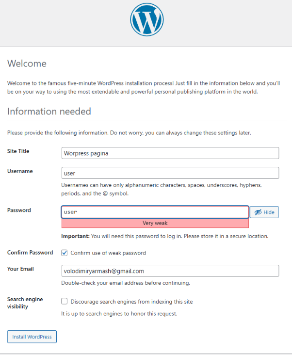

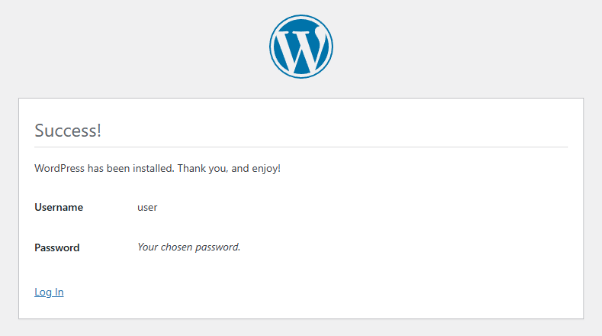

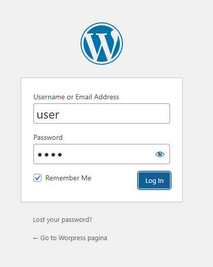

Estamos dentro.

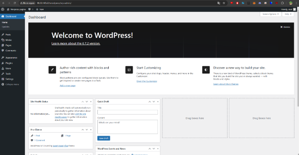

**Conexión de EFS a directorio WP-Content**

Ahora conectaremos EFS al directorio wp-content para almacenaje de fotos y multimedia.

Apagamos apache2:

`sudo systemctl stop apache2`

Cambiamos el  nombre del archivo situado en /var/www/html/wordpress/wp-content a wp-content-old

Pasamos la carpeta a nuestro directorio donde hemos montado EFS:

`sudo mv /var/www/html/wordpress/wp-content-old /home/ubuntu/efs`

Borramos el archivo inicial del wp-content para evitar conflictos:

`sudo rm /var/www/html/wordpress/wp-content`

Creamos una vinculación de la carpeta wp-content en el EFS con el comando:

`sudo ln -s /home/ubuntu/efs/wp-content /var/www/html/wordpress/wp-content`

Modificamos los permisos de la carpeta EFS para que el usuario apache pueda leer y escribir en ella:

`sudo chown -R www-data:www-data /home/ubuntu/efs/wp-content`

`sudo chmod -R 775 /home/ubuntu/efs/wp-content`

Comprobamos la redirección:

`ll /var/www/html/wordpress/`

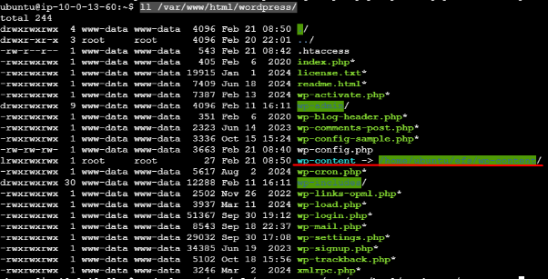

Finalmente , iniciamos apache para que se apliquen los cambios:

`sudo systemctl start apache2`

