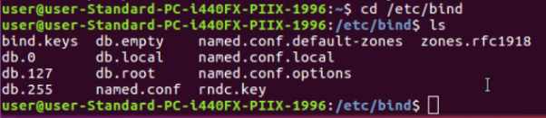
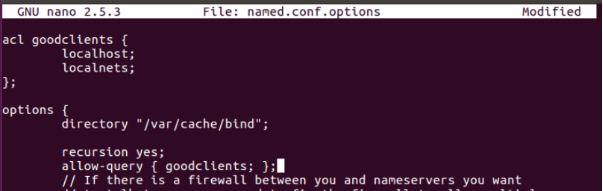
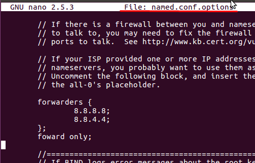
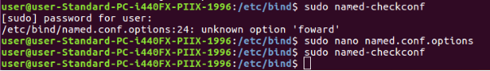
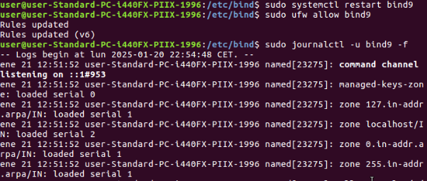
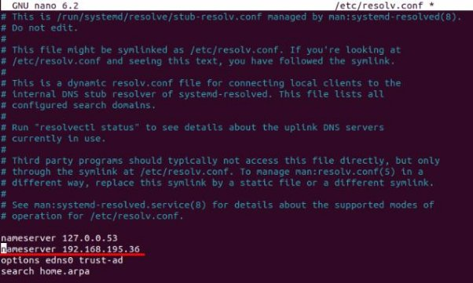
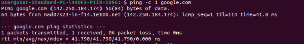
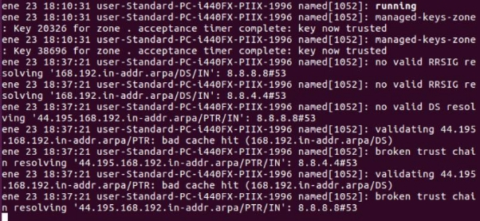
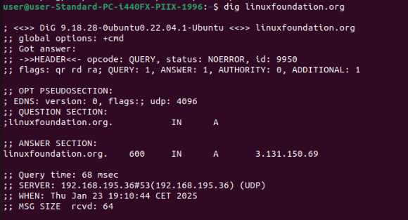
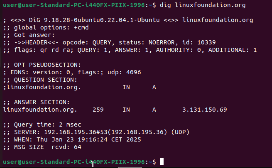



Servicio de Red e Internet 

Volodimir Yarmash Yarmash 

Índice 

[**Lee el artículo anterior. Instala y configura bin9 en primer lugar como servidor caché y por último como forwarding.............................................................................................. 3](#_page2_x72.00_y290.36)** 

- [**Comprueba la sintaxis del archivo de configuración (named-checkconf)....................3](#_page2_x72.00_y355.96)** 
- [**Visualiza el archivo log y comprueba que responde adecuadamente (/var/log/syslog) 3](#_page2_x72.00_y398.28)** 

  **DNS [https://www.digitalocean.com/community/tutorials/how-to-configure-bind-as-a-caching-or-for warding-dns-server-on-ubuntu-16-04](https://www.digitalocean.com/community/tutorials/how-to-configure-bind-as-a-caching-or-forwarding-dns-server-on-ubuntu-16-04)** 

  <http://www.zytrax.com/books/dns/ch4/> <https://help.ubuntu.com/community/BIND9ServerHowto> 

  **Libro Pro DNS and BIND (Chapter 4 DNS types) <http://it-ebooks.info/book/5022/>** 

  **Ejercicio** 
  # Lee el artículo anterior. Instala y configura bin9 en primer lugar como servidor caché y por último como forwarding.  
- Comprueba la sintaxis del archivo de configuración (named-checkconf) 
- Visualiza el archivo log y comprueba que responde adecuadamente (/var/log/syslog) 

Para instalar Bind9, debemos hacer un  

sudo apt-get update y 

sudo apt-get install bind9 bind9utils bind9-doc 

Ahora tenemos que configurar Bind para que actúe como un servidor DNS de almacenamiento en caché. 

Entramos a cd /etc/bind 

Entramos en el archivo named.conf.options con el comando sudo nano named.conf.options  Y creamos un bloque introduciendo por encima alc goodclients {};  

Lo que vamos a hacer es introducir ips que se les debe permitir usar este servidor DNS Ahora tenemos que configurar el ACL para que Bind lo lea. Bind primero recurre a allow-query-cache, luego a allow-query y finalmente a localcost y localnet. 

Agregamos   recursion yes; allow-query { goodclients; }; a options y guardamos. 

Ahora debemos cambiar la configuración para que el servidor ya no intente realizar consultas recursivas por sí mismo. 

Para ello debemos configurar una lista de servidores de almacenamiento en cache a los que reenviar nuestras solicitudes. 

Añadimos Forwarders {8.8.8.8; 8.8.4.4;}; que contiene las direcciones ip de los servidores dns de google. 

Y escribimos forward only; para que el servidor SOLO  reenvie todas las solicitudes y apra que no resuelva peticiones por su cuenta. 

Comprobamos la configuración con el comando sudo named-checkconf; en mi caso ha resultado encontrar  un fallo. Lo corregimos 

Reiniciamos bing9 y podemos ver los registros del servicio Bind9 en tiempo real 

En este punto Bind esta configurado para actuar como servidor dns. Entramos al equipo cliente 

Modificamos el archivo resolv.conf con sudo nano /etc/resolv.conf  Agregamos un nameserver y la ip de nuestro dns server 

Hacemos ping a Google.com y estos son los resultados  

Y estos son los logs del DNS server: 

Podemos ver registros como: 

managed-keys-zone: Key 20326… El servidor DNS ha confiado en una clave pública específica asociada con DNSSEC. Esto es parte del proceso de validación de DNSSEC, donde el servidor verifica las claves para garantizar que las respuestas DNS sean seguras. no valid RRSIG resolving El servidor Bind intentó validar un registro de firma DNSSEC pero no encontró uno válido. Esto puede ocurrir si la zona DNS no está firmada con DNSSEC validating [44.195.168.192.in-addr.arpa/DS](http://44.195.168.192.in-addr.arpa/DS)  Bind está intentando validar un registro DS 

(Delegation Signer) para la zona 44.195.168.192.in-addr.arpa, pero encontró datos en caché que no son válidos. El mensaje "bad cache hit" indica que el servidor tiene un registro en su caché que no pasó la validación. Esto puede deberse a un problema de sincronización dns o que el registro esta caducado. 

Vamos a probar si se guarda información en al cache. Escribimos dig linixfoundation.org  2 veces 

Como podemos observar, la diferencia del Query time es bastante. Eso es porque si está configurado correctamente. 
