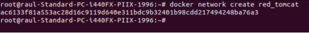
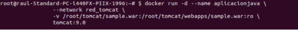
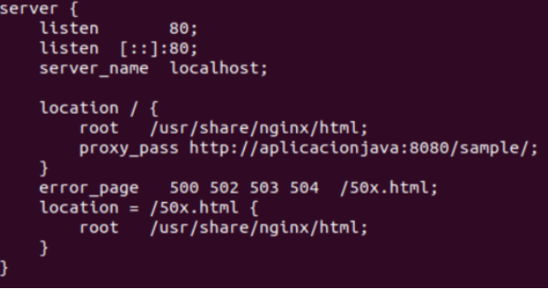
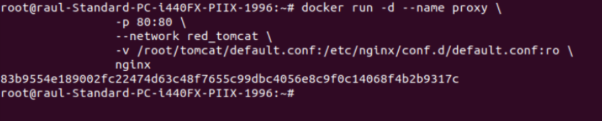
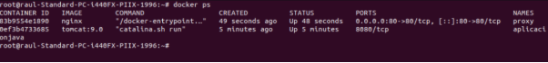
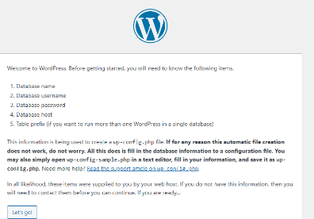

![ref1]

Servicio de Red e Internet

Volodimir Yarmash Yarmash

![ref1]

Índice

[**Tomcat + Nginx - Ejemplo 3	3**](#_bagk0tcf59tj)**

[**2. Desplegar Tomcat	3**](#_g4ow1dki30b2)

[**3. Configurar Nginx como Proxy Inverso	4**](#_s4wk925hzgut)

![ref1]
# Tomcat + Nginx - Ejemplo 3
En este ejemplo vamos a desplegar una aplicación simple utilizando Tomcat como servidor de aplicaciones y Nginx como proxy inverso. Usaremos redes bridge personalizadas y bind mounts para enlazar los archivos de configuración entre el host y los contenedores.

1\. Crear la red bridge

Primero, creamos una red bridge personalizada para conectar los contenedores:

docker network create red\_tomcat

# 2. Desplegar Tomcat
A continuación, vamos a ejecutar el contenedor de Tomcat con un archivo .war que montamos desde el host. El archivo se coloca en el directorio /usr/local/tomcat/webapps/ dentro del contenedor.

Suponiendo que tenemos el archivo .war en el directorio adecuado (~/tomcat/sample.war), creamos el contenedor:

docker run -d --name aplicacionjava \

`                `--network red\_tomcat \

`                `-v /home/vagrant/tomcat/sample.war:/usr/local/tomcat/webapps/sample.war:ro \

`                `tomcat:9.0

# 3. Configurar Nginx como Proxy Inverso
Ahora, configuramos Nginx para que actúe como un proxy inverso que redirige las solicitudes al contenedor Tomcat. La configuración de Nginx se encuentra en el archivo default.conf, donde usamos la directiva proxy\_pass para dirigir las peticiones hacia el contenedor Tomcat.

El archivo de configuración default.conf es el siguiente:

Para crear el contenedor Nginx con esta configuración, ejecutamos:

Entramos a Wordpress

[ref1]: Aspose.Words.f0796188-1f62-4e80-ba67-8b51e92d08a1.001.png
